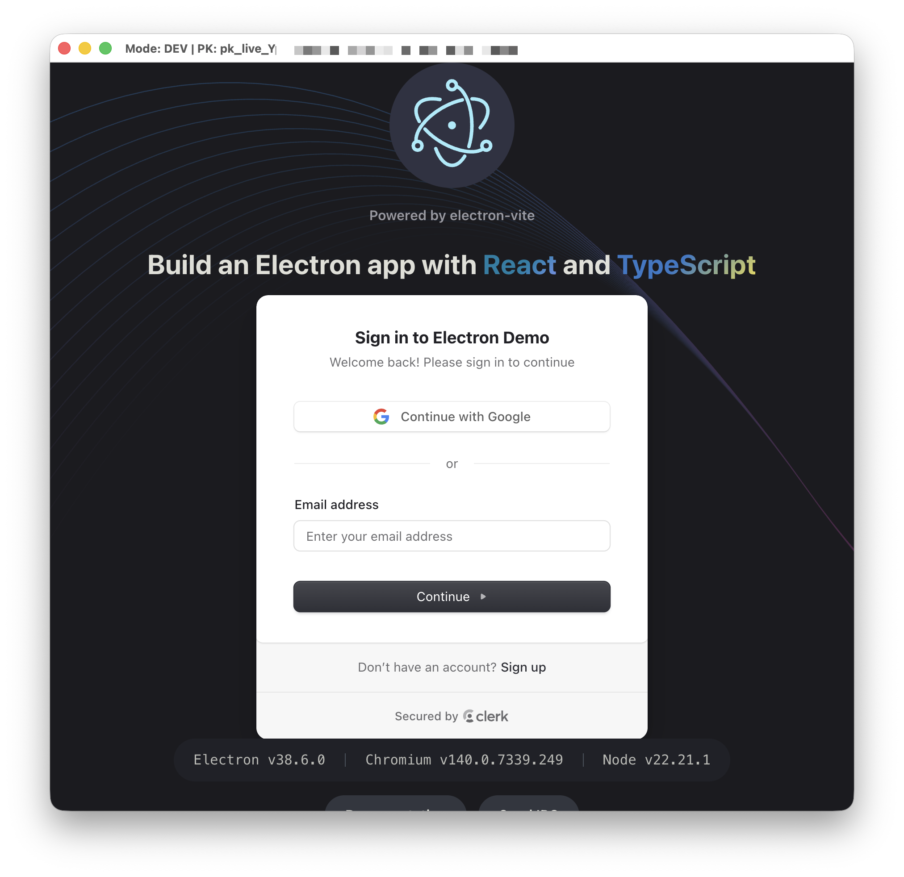
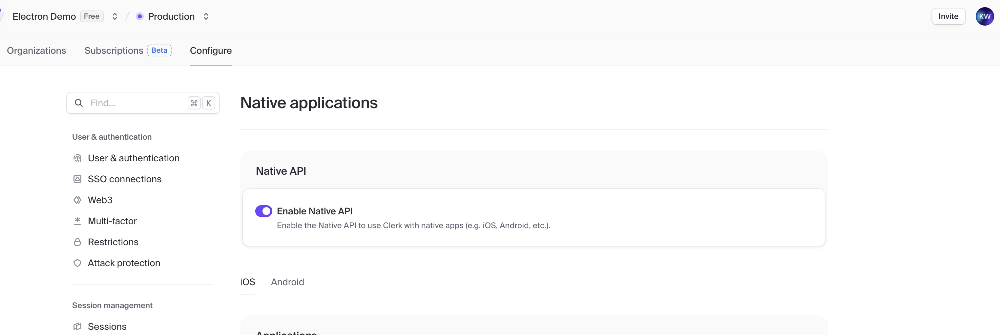

# 2025-11-13 Clerk Electron Vite

This is a small electron app to prove out using Clerk in the four following scenarios:

1. a development Electron app + Development Clerk PK
1. a development Electron app + Production Clerk PK
1. a MacOS executable + Development Clerk PK
1. a MacOS executable + Production Clerk PK

> [!CAUTION]
> This is only for debugging and investigative purposes.

## Running

Make sure you have your publishable key set

```
#.env
VITE_CLERK_PUBLISHABLE_KEY=pk_test_FIXME
```

Run the development app

```console
user@~: $ npm run dev
```

Build and run the MacOS executable

```console
user@~: $ npm run build:mac

user@~: $ ./dist/mac-arm64/clerk-electron-vite.app/Contents/MacOS/clerk-electron-vite
```

For both cases, Clerk _should load_, and the app should display the SignIn component:



## How it works

This requires the Native API setting to be toggled on for the Clerk instance:



This approach calls the Clerk frontend API the same way that the Expo SDK does (ref), in conjunction with a logical proxy via Electron Inter-Process Communication (IPC).

This "proxies" all client side (aka `renderer`) fetch calls through the `main` process, bypassing any CORS issues that a chromium app is prone to, and effectively causing the app to behave like a true native app.

Non-exhaustive shortlist of things that needs testing:

- [ ] CSP Script tag
- [ ] SSO dance
