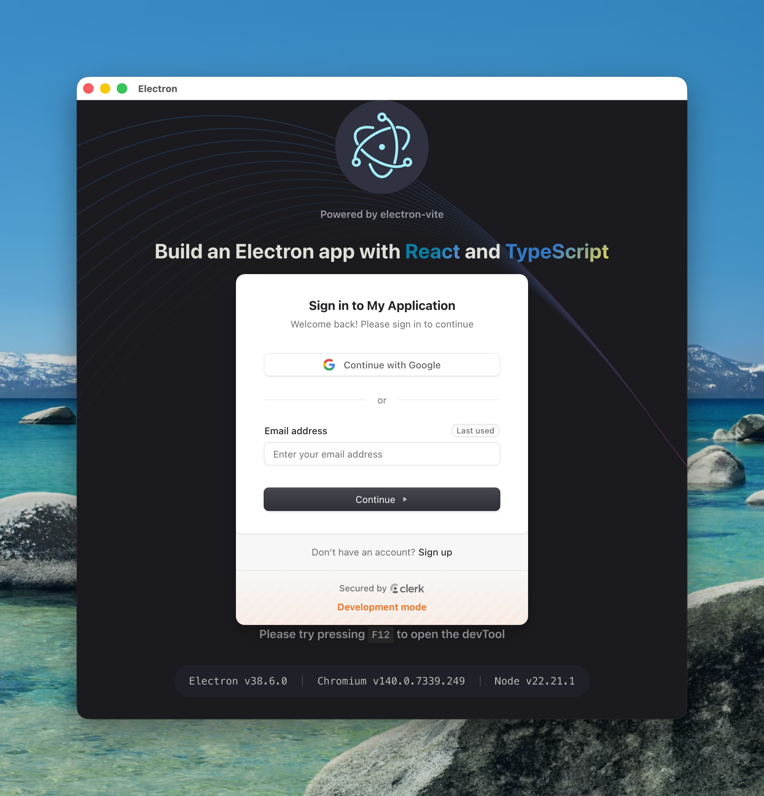

# 2025-11-13 Clerk Electron Vite

This is a small electron app to prove out using Clerk **Development** PK with an Electron app in two scenarios.

- a development Electron app
- a MacOS executable

> [!CAUTION]
> This is only for debugging and investigative purposes.

## Running

Make sure you have your publishable key set

```
#.env
VITE_CLERK_PUBLISHABLE_KEY=pk_test_FIXME
```

Run the development app

```console
user@~: $ npm run dev
```

Build and run the MacOS executable

```console
user@~: $ npm run build:mac

user@~: $ ./dist/mac-arm64/clerk-electron-vite.app/Contents/MacOS/clerk-electron-vite
```

For both cases, Clerk _should load_, and the app should display the SignIn component:


